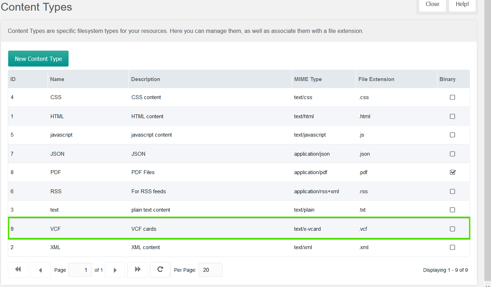
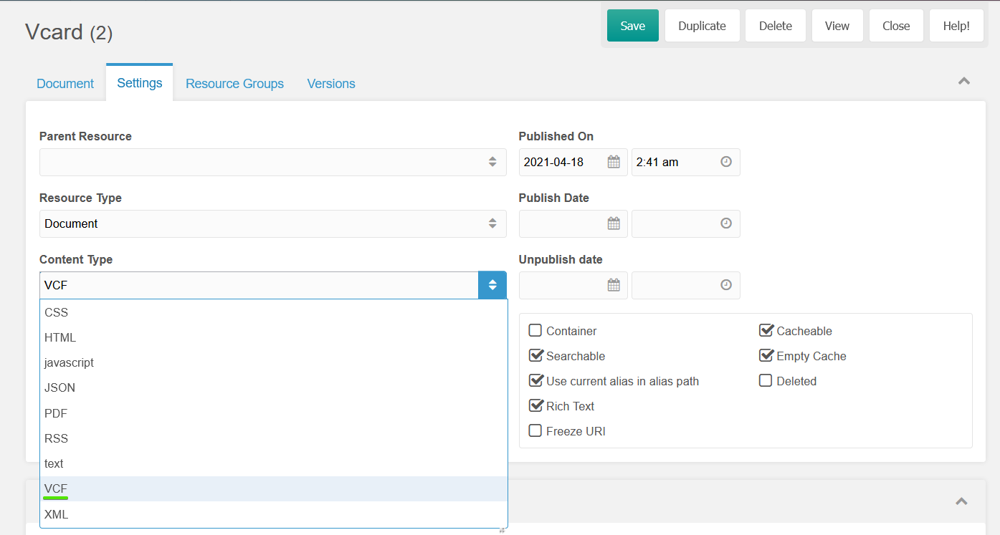

# UserMicroData
  

Displaying user data in one of two popular micro formats - [vCard](https://en.wikipedia.org/wiki/VCard) or [hCard](http://microformats.org/wiki/hcard)

[hCard](http://microformats.org/wiki/hcard)

For now snippet loads next basic User Profile fields: `fullname`, `photo`, `address`, `city`, `zip`, `state`, `phone`, `fax`, `email`, `website`, `country`, process them and wrap in appropriate form according to micro format RFC's.

## Example snippet call for vCard output

```
[[!UserMicroData?
    &uid=`123`
    &companyName=`Tesla Motors`
	&mode=`vCard`
	&vName=`vCard.vcf`
]]
```

Example above outputs `.vcf` with all appropriate data. Additionally you can specify company name and `vcf` output file name.



Package provides additional `VCF` Content Type from the box, for the page where you want to load such `.vcf` you should update Context Type:




## Example snippet call for hCard output

Default MODX tags
```
[[!UserMicroData?
    &uid=`123`
    &companyName=`Virgin`
	&mode=`hCard`
	&toPlaceholder=`userHCardPlaceholder`
]]
```

Shows `hCard` HTML code as usual inside `[[+userHCardPlaceholder]]`, no other Content Type is neeed, it was for `vCard` only. 


## Snippet parameters

| Parameter                  | Description                                                                                          | Default value  |
|----------------------------|------------------------------------------------------------------------------------------------------|----------------|
| uid                        | User ID for which selected card will be generated. Can be passed via `$_GET['uid'] as well`          |                |
| mode                       | Card type, two options are currently available - `vCard` or `hCard`                                  | `vCard`        |
| vTpl                       | if `vCard` mode was selected this tpl will be used for `.vcf` card output                            | `umcVCardTpl`  |
| vName                      | if `vCard` mode was selected here you can pass `.vcf` name                                           | `vCard.vcf`    |
| hTpl                       | if `hCard` mode selected this tpl will be used for HTML card output                                  | `umcHCardTpl`  |
| companyName                | Company name for user, otherwise `site_name` System setting will be used                             | `site_name`    |
| toPlaceholder              | Will assign the result to this placeholder instead of outputting it directly.Works for `hCard` only  |                |

jCard and xCard format support will be added shortly. Also additional user fields will be used later as well. 